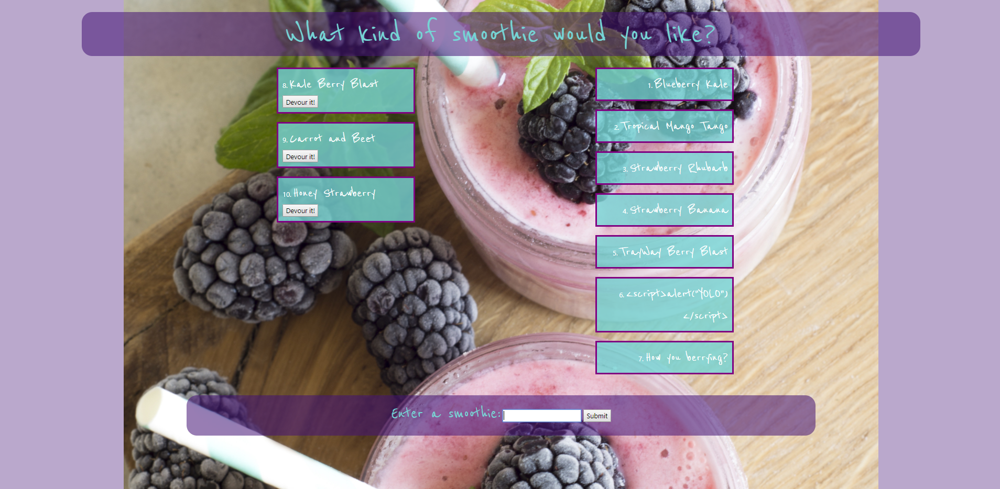

# Smoothie-Shop
What’s better than an ice cold, freshly blended, bursting with flavor smoothie?! Saddle up to the Smoothie Shop and order a tall one of your fav. When you’re ready, devour it. Cheers!

Smoothie Shop is a full-stack app that was created using several components (see below for a full list). It follows the MVC design pattern, and uses Node and MySQL to query and route data into the app, and generates the HTML the user sees from Handlebars. 

## How to Use
To get started ordering smoothies, open up the app. There will be a few orders available in case you’d like one of those. Alternatively you can type a smoothie into the available field. Once you submit your order, it will populate on the left hand side of the screen, where all available smoothies generate. Once you click ‘devour it’, the smoothie will pop over to the right hand side of the screen and will no longer be available to devour. Using Heroku, Jaws DB and MySQL, Smoothie Shop maintains data persistence. 

## GitHub Link
https://github.com/citylights521/Smoothie-Shop

## Heroku Link
https://smoothie-shop.herokuapp.com/

## Components Used
* MySQL
* Node
* Express
* Jaws DB
* Handlebars
* ORM
* Heroku
* MVC
* CSS
* Bootstrap
* Markdown
* Visual Studio Code
* JavaScript
* GitHub
* Git Bash
* Pexels
* Google Fonts
* Favicon
* Nodemon
* Workbench 

## Author
Claire Gibeau

## Feedback
The MVC file structure allows information to be organized in a consistent way in this app. Jaws DB was used for an extensive back-end, with a simple but functional front-end for inputting data.

